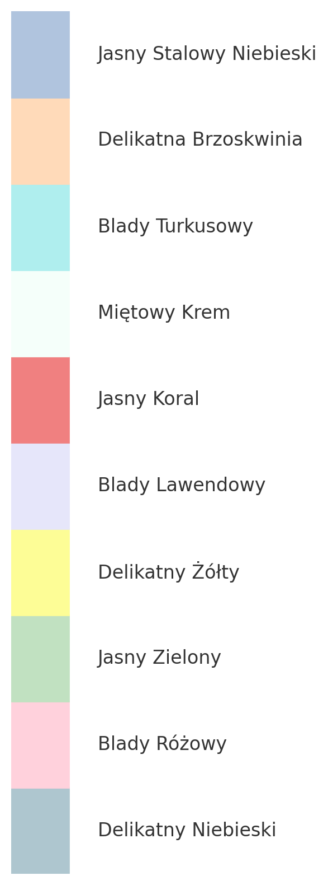

## Aplikacja CMDB

### Autorzy: Dawid Skrzypacz, Witold Mikołajczak

#### [Dokumentacja Techniczna: System CMDB](#dokumentacja-techniczna-system-cmdb)

1. [Wprowadzenie](#wprowadzenie)
2. [Opis Systemu CMDB](#opis-systemu-cmdb)
3. [Funkcjonalności Systemu](#funkcjonalności-systemu)
4. [Architektura Systemu](#architektura-systemu)
5. [Technologie Wykorzystane](#technologie-wykorzystane)
6. [Instrukcje Uruchomienia Projektu ASP.NET](#instrukcje-uruchomienia-projektu-aspnet)

---

### Wprowadzenie

System Configuration Management Database (CMDB) stanowi kluczowy element infrastruktury informatycznej, umożliwiając organizacjom zarządzanie i kontrolę nad składnikami oraz konfiguracją swoich zasobów IT. Niniejsza dokumentacja techniczna ma na celu przedstawienie struktury, funkcjonalności oraz technologii wykorzystanych w projekcie implementacji systemu CMDB opartego na platformie ASP.NET i bazie danych SQL Server.

### Opis Systemu CMDB

CMDB jest centralnym repozytorium danych, które przechowuje informacje dotyczące wszystkich zasobów IT w organizacji, takich jak sprzęt komputerowy, oprogramowanie, sieci, usługi oraz ich wzajemne zależności i relacje. System pozwala na zarządzanie pracownikami w firmie oraz przypisywanie do nich dostępnych zasobów, a także umożliwia gromadzenie, zarządzanie i wizualizację danych konfiguracyjnych, co pozwala administratorom na skuteczne monitorowanie i kontrolę infrastruktury IT.

### Funkcjonalności Systemu

- Zarządzanie Zasobami: CMDB umożliwia rejestrowanie, aktualizowanie i usuwanie zasobów IT, takich jak serwery, komputery, urządzenia sieciowe, oprogramowanie, usługi i aplikacje.
- Relacje Między Zasobami: System pozwala definiować i śledzić relacje między różnymi zasobami, co umożliwia kompleksowe zrozumienie infrastruktury IT i identyfikację zależności.
- Wizualizacja Konfiguracji: CMDB oferuje narzędzia do wizualizacji konfiguracji, w tym graficzne prezentacje zasobów i ich relacji, ułatwiając zrozumienie struktury systemu.
- Śledzenie Historii Konfiguracji: System przechowuje historię zmian konfiguracji, co umożliwia śledzenie ewolucji infrastruktury IT oraz przywracanie poprzednich stanów.

### Architektura Systemu

System CMDB oparty jest na architekturze klient-serwer, gdzie warstwa prezentacji jest realizowana za pomocą technologii ASP.NET, a warstwa danych przechowywana jest w bazie danych SQL Server. Komunikacja między warstwami odbywa się poprzez interfejsy programistyczne API.

### Technologie Wykorzystane

- ASP.NET: Platforma do budowy aplikacji internetowych, wykorzystywana do implementacji warstwy prezentacji systemu CMDB.
- SQL Server: System zarządzania relacyjnymi bazami danych, służący do przechowywania danych konfiguracyjnych w CMDB.
- C#: Język programowania używany w środowisku .NET Framework do tworzenia logiki biznesowej i interfejsów aplikacji.
- HTML/CSS: Technologie webowe wykorzystywane do tworzenia interfejsu użytkownika w warstwie prezentacji.
- JavaScript: Język programowania stosowany do implementacji dynamicznych funkcjonalności interfejsu użytkownika.
- REST API: Interfejs programistyczny umożliwiający komunikację między warstwą prezentacji a warstwą danych.

### Instrukcje Uruchomienia Projektu ASP.NET

1. **Pobierz kod źródłowy**: Sklonuj repozytorium projektu z [GitHub](https://github.com/dawidskrzypacz/CMDB).
2. **Otwórz projekt w Visual Studio Code**: Uruchom Visual Studio Code i otwórz folder zawierający projekt CMDB.
3. **Przywróć zależności:** Przed pierwszym uruchomieniem projektu wykonaj polecenie dotnet restore w terminalu Visual Studio Code, aby zainstalować wszystkie niezbędne zależności pakietów NuGet.
```sh
dotnet restore
```
4. **Zbuduj projekt:** Następnie wykonaj polecenie dotnet build, aby zbudować projekt i sprawdzić, czy nie ma błędów kompilacji.
```sh
dotnet build
```
5. **Uruchom aplikację:** Aby uruchomić aplikację, użyj polecenia dotnet run.
```sh
dotnet run
```

Aplikacja zostanie uruchomiona lokalnie i będzie dostępna pod adresem http://localhost:5271 w przeglądarce internetowej.

---

# Paleta Kolorów dla Projektu CMDB




## Kolory Podstawowe

### Delikatny Niebieski
- **Hex**: #AEC6CF
- **RGB**: 174, 198, 207
- **HSL**: 196, 30%, 75%

### Blady Różowy
- **Hex**: #FFD1DC
- **RGB**: 255, 209, 220
- **HSL**: 347, 100%, 91%

### Jasny Zielony
- **Hex**: #C1E1C1
- **RGB**: 193, 225, 193
- **HSL**: 120, 39%, 82%

### Delikatny Żółty
- **Hex**: #FDFD96
- **RGB**: 253, 253, 150
- **HSL**: 60, 96%, 79%

### Blady Lawendowy
- **Hex**: #E6E6FA
- **RGB**: 230, 230, 250
- **HSL**: 240, 66%, 94%

## Kolory Dodatkowe

### Jasny Koral
- **Hex**: #F08080
- **RGB**: 240, 128, 128
- **HSL**: 0, 79%, 72%

### Miętowy Krem
- **Hex**: #F5FFFA
- **RGB**: 245, 255, 250
- **HSL**: 150, 100%, 98%

### Blady Turkusowy
- **Hex**: #AFEEEE
- **RGB**: 175, 238, 238
- **HSL**: 180, 65%, 81%

### Delikatna Brzoskwinia
- **Hex**: #FFDAB9
- **RGB**: 255, 218, 185
- **HSL**: 28, 100%, 86%

### Jasny Stalowy Niebieski
- **Hex**: #B0C4DE
- **RGB**: 176, 196, 222
- **HSL**: 214, 41%, 78%

## Wytyczne dotyczące użytkowania

1. **Kolory Podstawowe**: Używaj tych kolorów głównie w całej aplikacji do tła, wyróżnień i głównych elementów interfejsu użytkownika.
2. **Kolory Dodatkowe**: Te kolory mogą być używane do akcentów, przycisków i innych drobnych elementów, aby uzupełnić podstawową paletę.
3. **Spójność**: Zapewnij spójne użycie kolorów w różnych komponentach, aby utrzymać jednolity wygląd i charakter aplikacji.
4. **Dostępność**: Zapewnij odpowiedni kontrast między tekstem a tłem dla czytelności i dostępności.

Przestrzegając tej palety kolorów, dążymy do stworzenia estetycznego i przyjaznego dla użytkownika interfejsu dla projektu CMDB.

